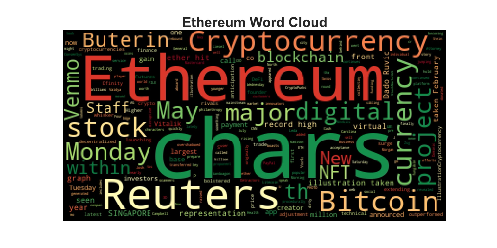

# Unit 12—Tales from the Crypto

## Background

There's been a lot of hype in the news lately about cryptocurrency, so you want to take stock, so to speak, of the latest news headlines regarding Bitcoin and Ethereum to get a better feel for the current public sentiment around each coin.

In this assignment, have applied apply natural language processing to understand the sentiment in the latest news articles featuring Bitcoin and Ethereum. Also applied fundamental NLP techniques to better understand the other factors involved with the coin prices such as common words and phrases and organizations and entities mentioned in the articles.

## Submission files

[Crypto Sentiment Jupyter Notebook ](./Submission/crypto_sentiment.ipynb)

---

###  Sentiment Analysis
 
>
> | Question | Answer |
> | --- | --- |
> | Which coin had the highest mean positive score? | Bitcoin |
> | Which coin had the highest negative score? | Ethereum |
> | Which coin had the highest positive score? | Bitcoin |
>
--- 

###  Word Clouds

#### Bitcoin 

---

#### Ethereum 

###  Word Clouds With Stop Words Feature Enabled 

#### Bitcoin 

#### Ethereum 

### 3 - Named Entity Recognition

* [Bitcoin Named Entity Recognition](https://morjaria.github.io/UnitTwelveHW/Images/btc_NER.html)
* [Ethereum Named Entity Recognition](https://morjaria.github.io/UnitTwelveHW/Images/eth_NER.html)

